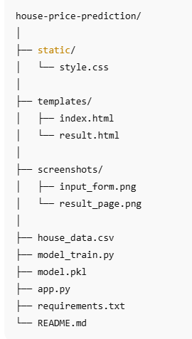
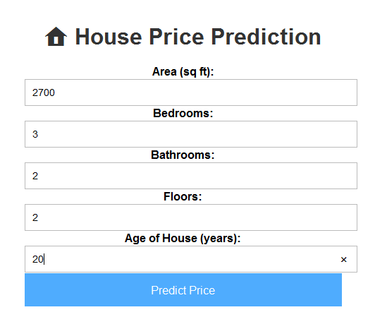
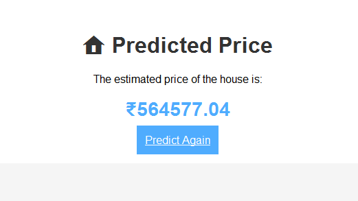

#  House Price Prediction Web App

A **Flask-based Machine Learning web application** that predicts the price of a house **in Indian Rupees (₹)** based on property features such as area, bedrooms, bathrooms, floors, and age of the house.  
The prediction is powered by a **trained Linear Regression model**.

---

##  Overview
Estimating property prices can be challenging for both buyers and sellers.  
This web application helps provide **accurate house price predictions** by analyzing essential property attributes.  

With a **responsive design** and **real-time predictions**, this app is useful for:
- Real estate agencies
- Property listing platforms
- Home buyers and sellers

---

##  Features
-  Predicts **house price in ₹** instantly  
-  **Linear Regression model** for prediction  
-  Dataset stored in CSV format for easy updates  
-  Clean, **responsive frontend** built with HTML & CSS  
-  Real-time prediction using Flask  
-  Easy to train with your own dataset  

---

##  Tech Stack
- **Python 3.10+**
- **Flask**
- **scikit-learn**
- **pandas**
- **HTML/CSS**

---

##  Project Structure

---

##  Installation & Setup

### 1️ Clone the Repository

git clone https://github.com/yourusername/house-price-prediction.git
cd house-price-prediction

### 2️ Install Dependencies

pip install -r requirements.txt

### 3️ Train the Model
Train the Linear Regression model using the dataset:

python model_train.py

### 4️ Run the Web App
python app.py
Open your browser and visit:http://127.0.0.1:5000/

 Use Cases
 Real estate companies for price estimation

 Property listing portals to auto-suggest prices

 Home buyers & sellers for quick valuations

 Market analysis tools for housing trends

###  Future Enhancements
Add location as a feature for better accuracy

Support for multiple regression models

Deployment on Heroku or Render

Option to upload CSV for bulk predictions

##  Screenshots

###  Input Form

###  Prediction Result

